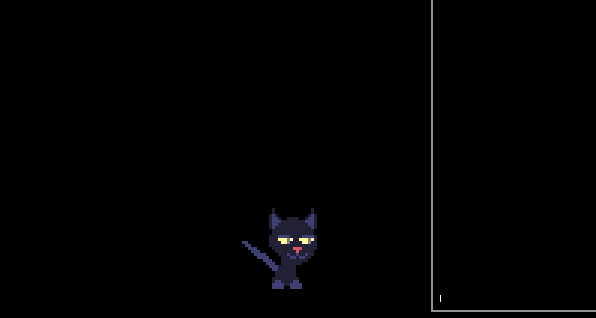

# <span style="color: #94f">NikoEngine.lua</span>

Creating an ~Engine~ that can serve as a starting point for future game projects.

The goal is to have something organized exactly how I want, since I've been getting more picky with game engines by the minute


## Features:
  
  ### "Instance Oriented"
  - Easy instance management. Everything is an instance
  - Access to callstacks for updating/drawing so you don't have to give up on flexibility

  ### "Classy"
  - Entity -> Actor -> Player class system
  - Painless sprite import and animation setup

  ```lua
  Player = NewActor(16,16)
  Player.setSprite('cat.png')
  Player.sprite.defineAnimation('idle', {
    frames = range(1,7),
    speed = 6
  })
  ```

  ### "I studied web development for months so now here we are"
  - Component based UI framework
  - Textboxes, menus, typography and more

  ```lua
  local _m = UI.menu({
    {text = "foo", callback = function() print('bar') end}
  })
  
  local _t = UI.Textbox({
    {text= "I don't know what 'foo' is and at this point I'm afraid to ask."}
  })
  ```

### "Shell city"
  - Integrated terminal in which you can call user-defined functions in-game




## Planned:
- Collisions (lol)
- Rooms
- Cutscenes
- Depth sorting via callback function for Draw Order
- Expanded debug system
- Lots more

---

Q: Why Lua?

A: Because I hate myself apparently.

A (for real): [Love2d](https://love2d.org) has the exact tooling that I want and not too much else. and Lua isn't THAT bad.... (Maybe I can still pivit to MoonScript...)