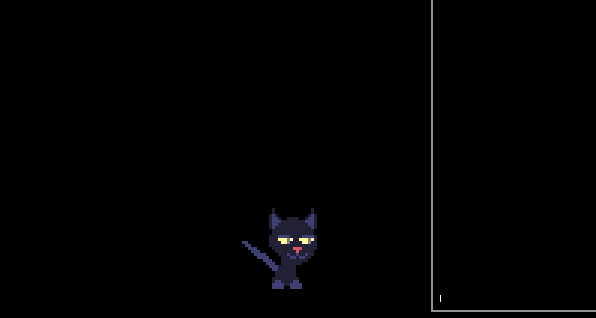
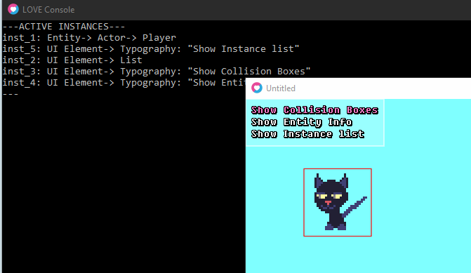
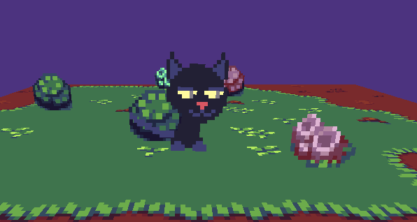
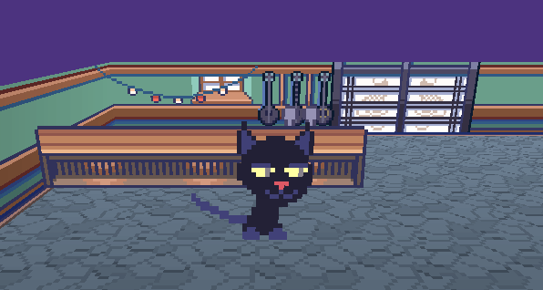
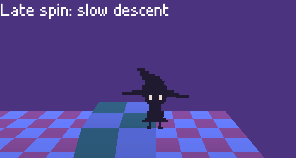
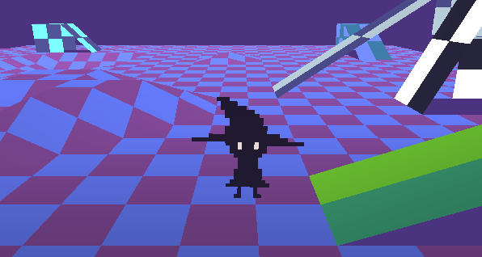

# <span style="color: #94f">NikoEngine.lua</span>

Creating an ~Engine~ that can serve as a starting point for future game projects.

The goal is to have something organized exactly how I want, since I've been getting more picky with game engines by the minute


## Features:
  
  ### "Instance Oriented"
  - Easy instance management. Everything is an instance
  - Access to callstacks for updating/drawing so you don't have to give up on flexibility

  ### "Classy"
  - Entity -> Actor -> Player class system
  - Painless sprite import and animation setup

  ```lua
  Player = NewActor(16,16)
  Player.setSprite('cat.png', 32)
  Player.sprite.defineAnimation('idle', {
    frames = range(1,7),
    speed = 6
  })
  ```

  ### "I studied web development for months so now here we are"
  - Component based UI framework
  - Textboxes, menus, typography and more

  ```lua
  local _m = UI.menu({
    {text = "foo", callback = function() print('bar') end}
  })
  
  local _t = UI.Textbox({
    {text = "I don't know what 'foo' is and at this point I'm afraid to ask."}
  })
  ```

  ### "Shell city"
  - Integrated terminal in which you can call user-defined functions in-game

  


  ### "Love3D???"

  - It turned out to be not that difficult to leverage the power of vertex shaders to make a 3D game with Love. One of my favorite things about working with such a minimalist framework is that there is a lot of freedom to expand in ways you may not have initially expected.

  

## Gallery

A small showcase of the fun things i've been able to build while working on NikoEngine:









